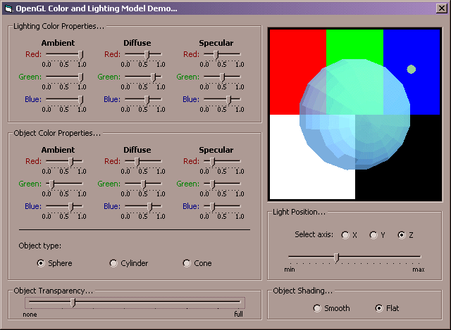



## OpenGL Color and Lighting Model Demonstration

### Description

This program demonstrates the color and lighting models implemented in OpenGL. It allows the user to view the effects of changing the ambient, diffuse, and specular color properties of the lighting in a scene. It also allows the user to view the effects of changing the ambient, diffuse, and specular color properties of an object in a scene. The user can choose between three different three-dimensional objects, and can even adjust the transparency of those objects in real time. Other options include the ability to move the light source in three-dimensional space along the X, Y, and Z axes, and the ability to select either flat or smooth shading for the object in the scene. This program is a great way for programmers new to OpenGL to learn and understand the OpenGL color and lighting models.

NOTE: This program requires Microsoft's OpenGL type library for Visual Basic, and as such I have included it in the ZIP file. Enjoy, and let me know what you think!
 
### More Info
 
Again, this program requires Microsoft's OpenGL type library for Visual Basic, and as such I have included it in the ZIP file.

             |
---                |---
**Submitted On**   |2001-05-16 13:54:26
**By**             |[Daniel S\. Soper](https://github.com/Planet-Source-Code/PSCIndex/blob/master/ByAuthor/daniel-s-soper.md)
**Level**          |Advanced
**User Rating**    |4.9 (59 globes from 12 users)
**Compatibility**  |VB 6\.0
**Category**       |[Graphics](https://github.com/Planet-Source-Code/PSCIndex/blob/master/ByCategory/graphics__1-46.md)
**World**          |[Visual Basic](https://github.com/Planet-Source-Code/PSCIndex/blob/master/ByWorld/visual-basic.md)
**Archive File**   |[OpenGL Col197085172001\.zip](https://github.com/Planet-Source-Code/daniel-s-soper-opengl-color-and-lighting-model-demonstration__1-23233/archive/master.zip)

